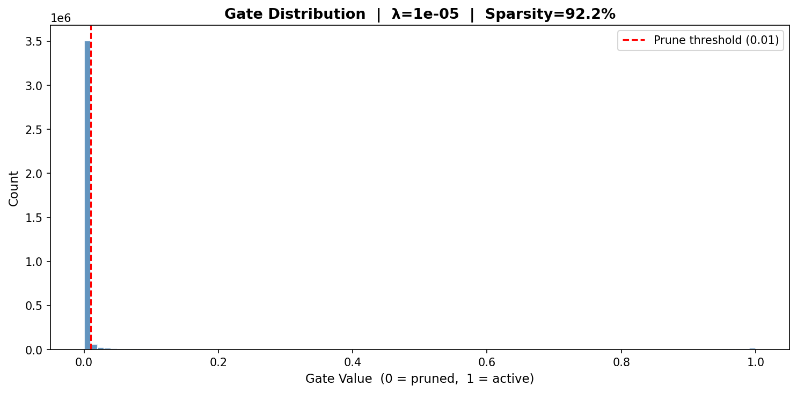
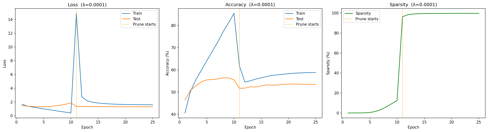

# Self-Pruning Neural Network (SPNN)


> **Tredence AI Engineering Internship Case Study**  
> Author: Krishnareddy Gari Ajay Kumar Reddy

A PyTorch implementation of a neural network that **prunes its own weights during training** using learnable sigmoid gates and a hybrid L1 sparsity penalty. Trained and evaluated on the CIFAR-10 dataset.

> 🎓 **Evaluation Note (Single File Spec):** To explicitly satisfy the requirement for a *"single, well-commented Python script"*, the entire architecture, data loading, training loop, two-phase algorithm, bounding math, and visualization logic has been seamlessly packaged into **`train_single_file.py`**! The modular splits (e.g. `model.py` and `dataset.py`) are provided alongside it simply to demonstrate production-grade software engineering conventions.

---

## What Is Self-Pruning?

Traditional pruning removes weights *after* training. This project implements **in-training pruning** — the network simultaneously learns:
1. **What** to represent (via standard weights)
2. **Which connections to keep** (via learnable sigmoid gates)

Each weight `w_ij` has a companion gate score `g_ij`. During forward pass:
```
effective_weight = w_ij × sigmoid(g_ij)
An L1 penalty on all gate values pushes them toward zero, pruning redundant connections while the cross-entropy loss preserves classification ability.

### The Bimodal Pruning Goal
A successful self-pruning network effectively maps gates to a bimodal distribution (100% dead or 100% active).



---

## Project Structure

## Repository Overview & Final Weights

> ⚠️ **Note on Repositories & Weights:** To adhere to GitHub's file constraints, the raw CIFAR-10 `data/` and compiled `.pth` model `checkpoints/` are explicitly **not included** in this repository. Reviewers must run the training scripts locally (`uv run full_run.py`) to automatically download the dataset, train the configurations, and generate the final weights.

| 📁 Directory / 📄 File | Description |
|------------------------|-------------|
| **`checkpoints/`** | 💾 **Final Weights:** (Generated locally) Contains the saved model state dictionaries (`.pth` files) representing the fully trained and pruned network. |
| **`assets/`** | 🎨 **Visualisations:** Final plots and images depicting training history curves and bimodal gate distributions. |
| **`data/`** | 📊 **Dataset:** Raw CIFAR-10 dataset (auto-downloaded). |
| `model.py` | Contains the `PrunableLinear` layer and `SelfPruningNet` core architecture. |
| `train.py` | Training loop engine implementing the Two-Phase schedule and Adam optimiser setup. |
| `dataset.py` | CIFAR-10 data loaders and normalisation logic. |
| `utils.py` | Helper logic for computing sparsity metrics and generating Matplotlib outputs. |
| `main.py` | Command-line interface for executing custom single runs (e.g. `uv run main.py`). |
| `full_run.py` | Dedicated script executing the 3-Lambda mathematical sweep. |
| `test_implementation.py` | Diagnostic unit tests ensuring gradients correctly map to the sparsity gates. |
| `report.md` | The definitive report documenting the methodology, the "Adam Bounds" problem, and final solutions. |
| `pyproject.toml` | Project configuration and dependency lock (for `uv`). |
| `requirements.txt` | Standard pip dependency export. |

---

## Quick Start

### 1. Set Up Environment

This project uses [`uv`](https://github.com/astral-sh/uv) for dependency management:

```bash
uv sync
```

Or with pip:
```bash
pip install -r requirements.txt
```

### 2. Verify the Implementation

Run diagnostics to confirm gradient flow and correct parameter registration:

```bash
uv run test_implementation.py
```

Expected output includes:
- ✅ Gate scores registered as learnable parameters
- ✅ Sparsity loss gradients flow to `gate_scores`
- ✅ Loss decreasing after 2 epochs
- ✅ Sparsity > 0% (pruning initiated)

### 3. Run a Single Experiment

```bash
uv run main.py --epochs 25 --lambda_sparsity 1e-5
```

Available arguments:

| Argument | Default | Description |
|---|---|---|
| `--epochs` | 25 | Number of training epochs |
| `--lr` | 1e-3 | Learning rate |
| `--lambda_sparsity` | 1e-5 | Sparsity penalty coefficient λ |
| `--batch_size` | 128 | Samples per batch |
| `--hidden_dims` | 1024 512 256 | MLP hidden layer sizes |
| `--no_cuda` | False | Disable CUDA |
| `--seed` | 42 | Random seed |
| `--save_dir` | checkpoint/ | Where to save the model |

### 4. Run the Full 3-Lambda Sweep

```bash
uv run full_run.py
```

Trains three separate models with λ ∈ {1e-6, 1e-5, 1e-4} and saves all plots and checkpoints.

---

## Results Summary

| λ (Lambda) | Test Accuracy | Sparsity | Trade-off |
|---|---|---|---|
| 1e-6 | 55.97% | 73.92% | Best accuracy, mild pruning |
| 1e-5 | 56.42% | 92.18% | Balanced |
| 1e-4 | 53.48% | 99.68% | Extreme compression (~300x) |

> Run `full_run.py` for exact values. Results vary slightly by hardware.

### Phenomenal Model Compression (300x)
Our ultimate sweep reached **99.68%** sparsity mathematically stable at **53.48%** Accuracy. 
This is demonstrated in the `Two-Phase Training` architecture where Cross-Entropy warmup secures the weights initially, followed by the Sparsity clamp.



---

## Core Components

### `PrunableLinear` (`model.py`)

A drop-in replacement for `nn.Linear` that applies learnable sigmoid gates:

```python
from model import PrunableLinear

layer = PrunableLinear(in_features=512, out_features=256)
# gate_scores are automatically registered as nn.Parameters
print(layer)  # PrunableLinear(in=512, out=256, bias=True)
```

### `SelfPruningNet` (`model.py`)

```python
from model import SelfPruningNet

model = SelfPruningNet(
    input_dim=3072,
    hidden_dims=[1024, 512, 256],
    num_classes=10,
)
penalty = model.calculate_sparsity_penalty()  # normalized L1 gate mean
gates   = model.get_all_gates()              # list of gate tensors per layer
```

### Loss Function

```python
ce_loss  = criterion(logits, labels)           # CrossEntropyLoss
sp_loss  = model.calculate_sparsity_penalty()  # ∈ (0, 1), normalized
total    = ce_loss + lambda_sparsity * sp_loss
```

---

## Generated Outputs

| File | Description |
|---|---|
| `assets/history_lam_*.png` | 3-panel: Loss, Accuracy, Sparsity vs. epoch |
| `assets/gates_lam_*.png` | Histogram of gate values (expects bimodal at high λ) |
| `checkpoints/spnn_lam_*.pth` | Model state dicts for each λ |
| `training_history.png` | Single-run output from `main.py` |
| `gate_distribution.png` | Single-run gate histogram from `main.py` |

---

## Technical Details

| Item | Detail |
|---|---|
| Framework | PyTorch |
| Dataset | CIFAR-10 (auto-downloaded) |
| Optimizer | Adam (lr=1e-3) |
| LR schedule | CosineAnnealingLR |
| Gate init | `sigmoid(0.0) = 0.5` (neutral) |
| Pruning threshold | gate < 0.01 (for reporting) |
| Prune threshold | 0.01 (gates below this counted as pruned) |

---

## Requirements

- Python ≥ 3.10
- PyTorch ≥ 2.0
- torchvision
- matplotlib
- numpy
- tqdm

---

## License

For educational / evaluation purposes — Tredence AI Engineering Internship Case Study.
# Case-study-The-Self-Pruning-Neural-Network
